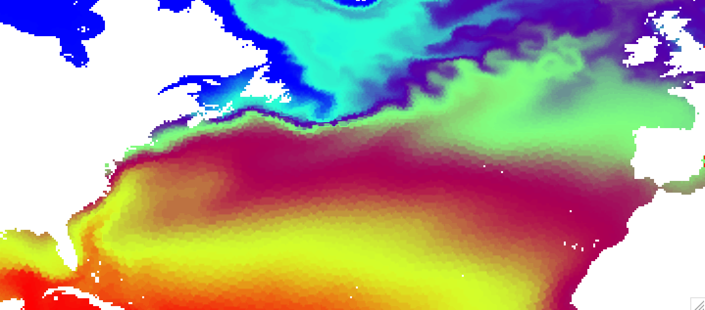
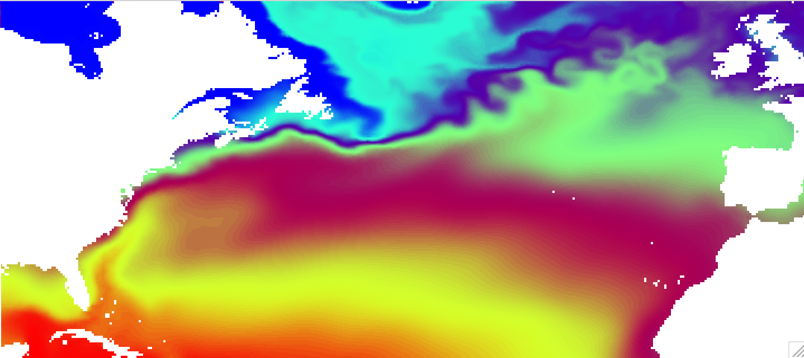

.. _scalar2geo:

scalar2geo
==========

Interpolates scalar data from FESOM mesh to regular lon/lat grid.

Basic usage
-----------

As minimum you should provide path to the mesh, path to the file, path were the ouptut will be stored and variable name::

    python scalar2geo.py  /path/to/mesh/ /path/to/file.nc /path/to/output/ temp

by default the field will be interpolated to the regular 1 degree grid. 

The resolution of the target grid is controlled by `-r` option, that accepts 2 arguments - number of longitudes and number of latitudes. For example to interpolate to the 1/4 degree grid for the box in the North Atlantic, you should do the following::

    python scalar2geo.py  -b -90 0 20 60 -r 360 160 /path/to/mesh/ /path/to/file.nc /path/to/output/ temp

If you do such interpolation for FESOM results on the COREII mesh and open resulting file in ncview, it will look like this 

You can clearly see imprint of the original mesh on the interpolated result. This is due to the nearest neighbor interpolation used by default. The advantage of this method is that it is very fast, but for some combunations of original and target grids can produce quite ugly results. There are several other interpolation methods, namelly `idist` (inverse distance, decent speed, `linear` (scipy implementation, slow), and `cubic` (scipy implementation, slowest and give strange results on corarse meshes). The default results for `idist` method will look like this:

You can further control `idist` results with radius of influence `-i` and number of neighbors to take in to account `-k`. 

The results for linear interpolation (`linear` option) will look much smoother, but interpolation will take considerably longer time:

The tool can process several files at once. You just have to specify path to your files with the wildcard like this::

    python scalar2geo.py -n 8 /path/to/mesh/ /path/to/file_year_*.nc /path/to/output/ temp

By default only once processor is used, so if you would like files to be processed in parallel, you have to specify the number of parallel processes `-n`, that is usually equals to the number of processors you would like to use.

Usage and options
-----------------

Below you can find complete list of options. You can allways display this list in the terminal by executing::

    python showo.py --help

::

    Usage: scalar2geo.py [OPTIONS] MESHPATH IPATH... OPATH VARIABLE

    meshpath - Path to the folder with FESOM1.4 mesh files.

    ipath    - Path to FESOM1.4 netCDF file or files (with wildcard).

    opath    - path where the output will be stored.

    variable - The netCDF variable to be converted.

    Options:
    -d, --depths TEXT               Depths in meters.  [default: -1]
    -b, --box <INTEGER RANGE INTEGER RANGE INTEGER RANGE INTEGER RANGE>...
                                    Map boundaries in -180 180 -90 90 format.
                                    [default: -180, 180, -80, 90]
    -r, --res <INTEGER INTEGER>...  Number of points along each axis (for lon
                                    and  lat).  [default: 360, 170]
    -i, --influence INTEGER         Radius of influence for interpolation, in
                                    meters.  [default: 80000]
    --interp [nn|idist|linear|cubic]
                                    Interpolation method. Options are nn -
                                    nearest neighbor (KDTree implementation,
                                    fast), idist - inverse distance (KDTree
                                    implementation, decent speed), linear (scipy
                                    implementation, slow) and cubic (scipy
                                    implementation, slowest and give strange
                                    results on corarse meshes).
    -t, --timestep INTEGER          Timstep from netCDF variable, starts with 0.
                                    If -1, all timesteps of the netCDF file will
                                    be used.  [default: 0]
    --abg <FLOAT FLOAT FLOAT>...    Alpha, beta and gamma Euler angles. If you
                                    plots look rotated, you use wrong abg
                                    values. Usually nessesary only during the
                                    first use of the mesh.
    -n, --ncore INTEGER             Number of cores to use in parralel
    -k INTEGER                      Number of neighbors to take in to account
                                    for idist interpolation.
    --help                          Show this message and exit.