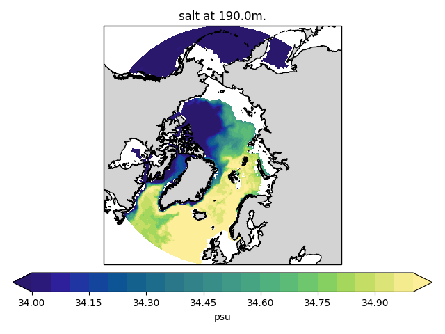

.. _showme:

Showme
======

Simple visualization tool for FESOM data. `Python <http://www.python.org/>`_ 

Basic usage
-----------
As minimum you should provide path to the mesh and path to the file::

    python showme.py /path/to/mesh/ /path/to/file.nc

You will get an image of global distribution of temperature (`temp`) at the first time step and smallest depth:

.. image:: img/showme1.png

To control different aspects of your plot you can provide additional options. For example this line::

    python showme.py -m np -b -180 180 50 90 -d 200 -l 34 35 21 --cmap haline /path/to/mesh/ /path/to/file.nc salt

will creaate image in the North Polar Stereo projection (`-m np`), with lon/lat boundaries of -180/180/50/90 (`-b -180 180 50 90`) ad 200 m depth (`-d 200`) with color levels spanning from 34 to 35 with 21 step (`-l 34 35 21`) and `haline` colormap from cmocean package (`--cmap haline`). The property to plot is `salt` (at the end of the line).

Usage and options
-----------------

Below you can find complete list of options. You can allways display this list in the terminal by executing::

    python showme.py --help
    
::

    Usage: showme.py [OPTIONS] MESHPATH IFILE [VARIABLE]

    meshpath - Path to the folder with FESOM1.4 mesh files.

    ifile    - Path to FESOM1.4 netCDF file.

    variable - The netCDF variable to be plotted.

    Options:
    -d, --depth FLOAT               Depth in meters.  [default: 0]
    -b, --box <INTEGER RANGE INTEGER RANGE INTEGER RANGE INTEGER RANGE>...
                                    Map boundaries in -180 180 -90 90 format.
                                    [default: -180, 180, -80, 90]
    -r, --res <INTEGER INTEGER>...  Number of points along each axis (for lon
                                    and  lat).  [default: 360, 170]
    -i, --influence INTEGER         Radius of influence for interpolation, in
                                    meters.  [default: 80000]
    -t, --timestep INTEGER          Timstep from netCDF variable, strats with 0.
                                    [default: 0]
    -l, --levels FLOAT...           Levels for contour plot in format min max
                                    numberOfLevels. If not provided min/max
                                    values from data will be used with 40
                                    levels.
    -q, --quiet                     If present additional information will not
                                    be printed.
    -o, --ofile PATH                Path to the output figure. If present the
                                    image will be saved to the file instead of
                                    showing it.
    -m, --mapproj [merc|pc|np|sp|rob]
                                    Map projection. Options are Mercator (merc),
                                    Plate Carree (pc), North Polar Stereo (np),
                                    South Polar Stereo (sp),  Robinson (rob)
                                    [default: rob]
    --abg <FLOAT FLOAT FLOAT>...    Alpha, beta and gamma Euler angles. If you
                                    plots look rotated, you use wrong abg
                                    values. Usually nessesary only during the
                                    first use of the mesh.  [default: 50, 15,
                                    -90]
    -c, --clim [phc|woa05|gdem]     Select climatology to compare to. If option
                                    is set the model bias to climatology will be
                                    shown.
    --cmap TEXT                     Name of the colormap from cmocean package or
                                    from the standard matplotlib set. By default
                                    `Spectral_r` will be used for property plots
                                    and `balance` for bias plots.
    --interp [nn|idist|linear|cubic]
                                    Interpolation method. Options are nn -
                                    nearest neighbor (KDTree implementation,
                                    fast), idist - inverse distance (KDTree
                                    implementation, decent speed), linear (scipy
                                    implementation, slow) and cubic (scipy
                                    implementation, slowest and give strange
                                    results on corarse meshes).  [default: nn]
    --ptype [cf|pcm]                Plot type. Options are contourf ('cf') and
                                    pcolormesh ('pcm')  [default: cf]
    -k INTEGER                      k-th nearest neighbors to use. Only used
                                    when interpolation method (--interp) is
                                    idist  [default: 5]
    --help                          Show this message and exit.