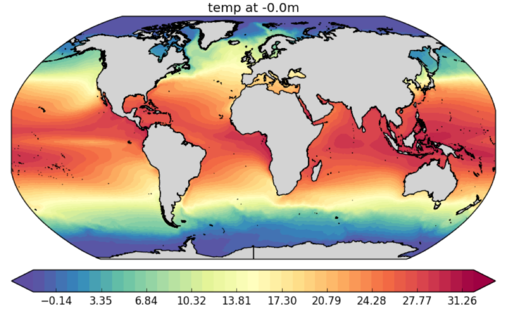

.. _showme:

Showme
======

Simple visualization tool for FESOM data. `Python <http://www.python.org/>`_ 

Basic usage
-----------
As minimum you should provide path to the mesh and path to the file::

    python showme.py /path/to/mesh/ /path/to/file.nc

You will get an image of global distribution of temperature (`temp`) at the first time step and smallest depth:

