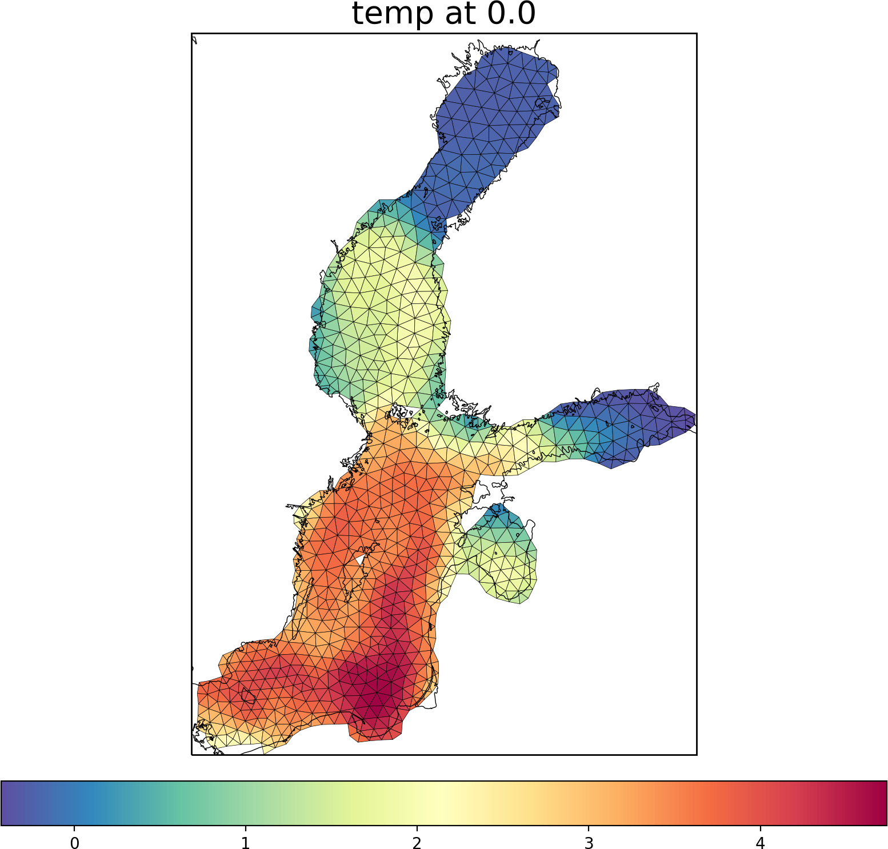
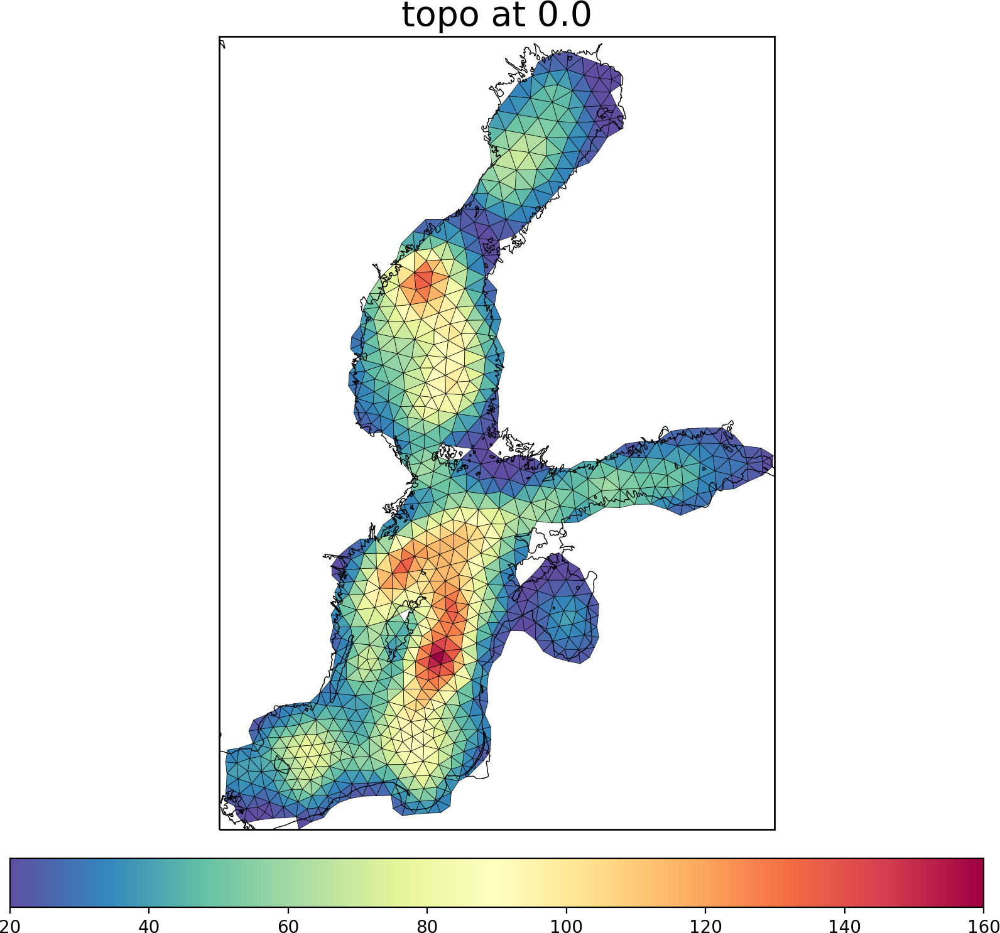

.. _showo:

showo
=====

Shows FESOM data on original grid.

Basic usage
-----------
As minimum you should provide path to the mesh and path to the file::

    python showo.py /path/to/mesh/ /path/to/file.nc

By default it will produce plot of the Baltic Sea temperature oh original grid. Quite often you youl like to plot topography on original grid - to do so, just provide `topo` as variable argument::

    python showo.py /path/to/mesh/ /path/to/file.nc topo

One can easliy change the region and get the following result::

     python showo.py -b -10 20 25 50 /path/to/mesh/ /path/to/file.nc topo

.. image:: img/showo3.png

Usage and options
-----------------

Below you can find complete list of options. You can allways display this list in the terminal by executing::

    python showo.py --help
    
::
    
    Usage: showo.py [OPTIONS] MESHPATH IFILE [VARIABLE]

    meshpath - Path to the folder with FESOM1.4 mesh files.

    ifile    - Path to FESOM1.4 netCDF file.

    variable - The netCDF variable to be plotted.

    Options:
    -d, --depth FLOAT               Depth in meters.  [default: 0]
    -b, --box <INTEGER RANGE INTEGER RANGE INTEGER RANGE INTEGER RANGE>...
                                    Map boundaries in -180 180 -90 90 format.
                                    [default: 13, 30, 54, 66]
    -t, --timestep INTEGER          Timstep from netCDF variable, strats with 0.
                                    [default: 0]
    -l, --minmax INTEGER...         Minimun and maximum values for plotting.
    -m, --mapproj [merc|pc|np|sp|rob]
                                    Map projection. Options are Mercator (merc),
                                    Plate Carree (pc), North Polar Stereo (np),
                                    South Polar Stereo (sp),  Robinson (rob)
    -q, --quiet                     If present additional information will not
                                    be printed.
    -o, --ofile PATH                Path to the output figure. If present the
                                    image will be saved to the file instead of
                                    showing it.
    --help                          Show this message and exit.